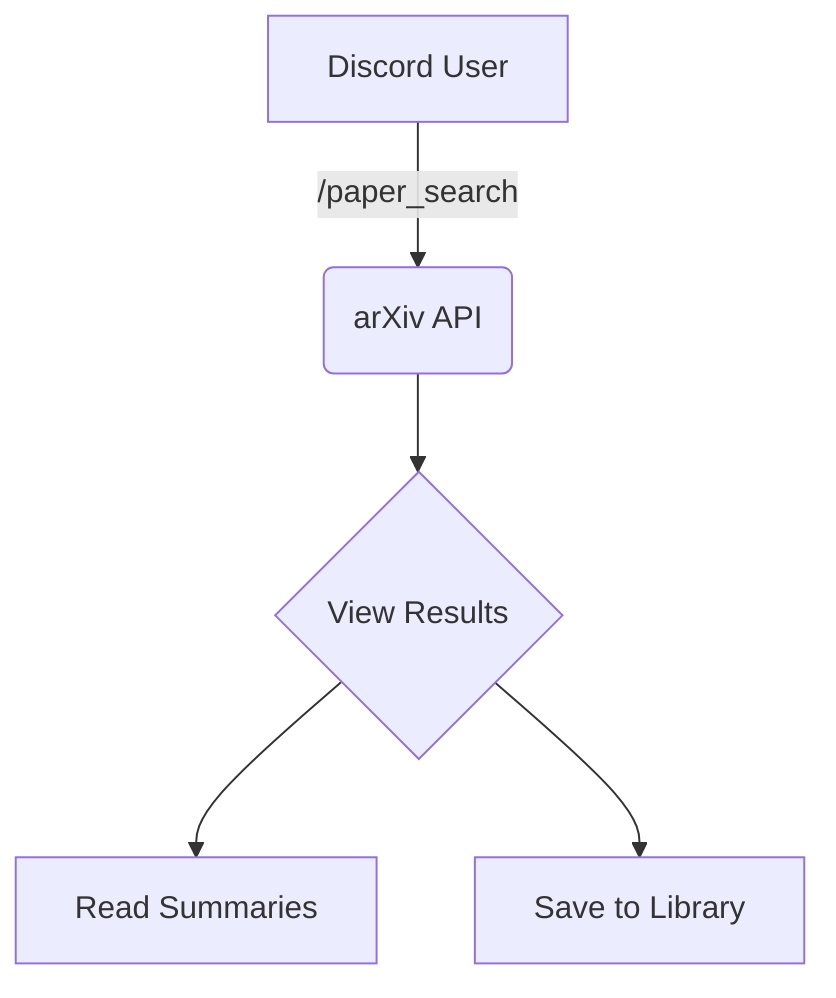
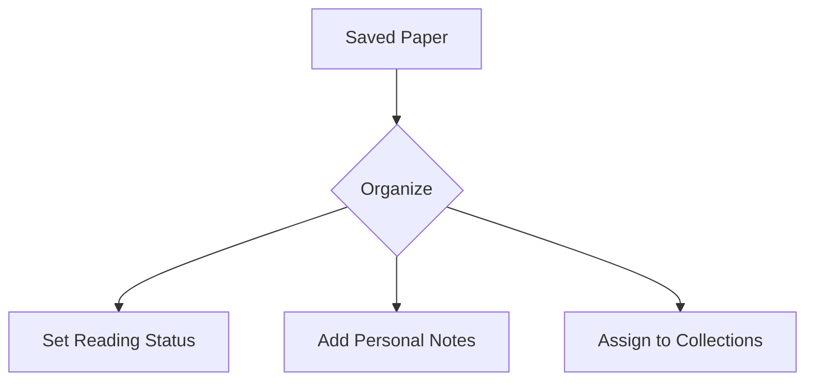
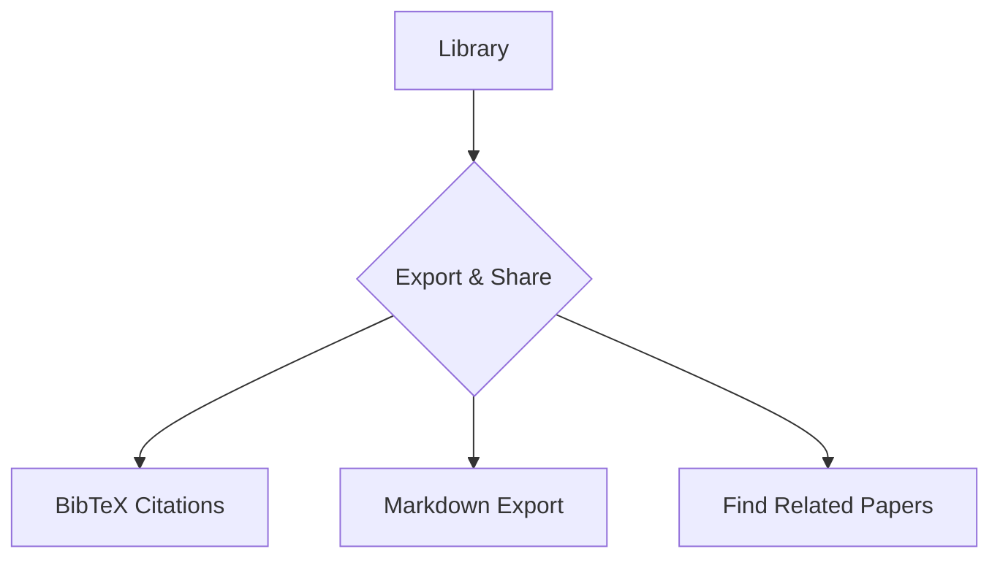

# 📚 Research Paper Assistant


> [!NOTE]
> An async Discord bot for discovering, organizing, and citing arXiv papers without leaving Discord — built for researchers and students who do their work where the conversation already is.

Supports paper search, personal libraries, collections, reading-status tracking, notes, related-paper discovery, and citation export through slash commands and interactive Discord UI components.

---

## 🌟 Features

````carousel

<!-- slide -->

<!-- slide -->

````

- **🔍 Search & Discover**: Query arXiv papers directly from Discord with category filtering and sorting.
- **📚 Personal Libraries**: Save papers to a per-user, per-guild SQLite library.
- **🗂️ Collections**: Organize saved papers into thematic collections (e.g., `thesis-sources`, `ml-papers`).
- **🔖 Tracking & Notes**: Track reading status (`to-read`, `reading`, `done`) and attach personal notes.
- **🔗 Citations**: Export citations for individual papers or entire collections in `bibtex`, `plain`, or `markdown` formats.
- **🧠 Recommendations**: Find related papers from saved library items using lightweight TF-IDF similarity ranking.

---

## 🛠️ Tech Stack

- **Language**: Python 3.11+
- **Discord API**: `discord.py`
- **Async I/O**: `aiohttp` + `aiosqlite`
- **Data & Parsing**: `defusedxml`
- **Database**: SQLite
- **Testing**: `pytest` + `pytest-asyncio`

---

## 🚀 Quick Start

> [!IMPORTANT]
> You need a Discord bot token with the `applications.commands` and `bot` scopes, plus the Message Content Intent enabled in the Developer Portal.

```bash
# Clone the repository
git clone git@github.com:adabarbulescu/research-paper-assistant.git
cd research-paper-assistant

# Setup virtual environment
python -m venv venv
source venv/bin/activate  # Windows: venv\Scripts\Activate.ps1

# Install dependencies
pip install -r requirements.txt

# Configure environment
cp .env.example .env
# Edit .env with your DISCORD_TOKEN and DISCORD_GUILD_ID

# Run the bot
python bot.py
```

---

## 💻 Commands Reference

### Search & Discovery
| Command | Description |
|---|---|
| `/paper_search <query>` | Search arXiv papers. Optional: `category`, `sort_by`, `sort_order`, `max_results` |
| `/paper_summary <query>` | Detailed summary of the top matching paper. |
| `/related_papers <arxiv_id>` | Find similar papers in your library based on title/abstract similarity. |

### Library Management
| Command | Description |
|---|---|
| `/my_library` | View your saved papers in a paginated UI. |
| `/library_by_status <status>` | Filter saved papers by `to-read`, `reading`, or `done`. |
| `/library_stats` | View statistics about your library (counts, top categories). |
| `/set_status <arxiv_id> <status>` | Set reading status for a saved paper. |
| `/remove_paper <paper_id>` | Remove a paper from your library completely. |

### Annotations
| Command | Description |
|---|---|
| `/add_note <arxiv_id> <note>` | Add or update a note on a saved paper (max 500 chars). |
| `/view_note <arxiv_id>` | View your note on a saved paper. |
| `/edit_note <arxiv_id> <note>` | Replace your note on a saved paper. |

### Collections
| Command | Description |
|---|---|
| `/create_collection <name>` | Create a new paper collection. |
| `/my_collections` | View all your collections. |
| `/add_to_collection <arxiv_id> <collection>` | Add a saved paper to a collection. |
| `/view_collection <name>` | View papers inside a specific collection. |
| `/remove_from_collection <arxiv_id> <collection>` | Remove a paper from a collection. |
| `/delete_collection <name>` | Delete a collection (papers stay in your library). |

### Export
| Command | Description |
|---|---|
| `/export_citation <arxiv_id>` | Generate a citation (format: `bibtex`, `plain`, `markdown`). |
| `/export_collection <name>` | Export citations for all papers in a collection. |

---

## 🧪 Testing

> [!TIP]
> Run the tests locally before submitting a pull request to ensure everything is working correctly!

```bash
python -m pytest tests/ -v
```

CI also runs [Ruff](https://docs.astral.sh/ruff/) (linting) and [Bandit](https://bandit.readthedocs.io/) (security scanning) — run `ruff check .` and `bandit -c bandit.yaml -r .` locally.

---

## 🐳 Docker Deployment

You can quickly deploy the bot using Docker or Docker Compose.

```bash
# Build and run with Docker
docker build -t research-paper-assistant .
docker run --env-file .env -e DATABASE_PATH=/data/library.db -v rpa_data:/data research-paper-assistant

# Or with Docker Compose
docker compose up --build -d
```